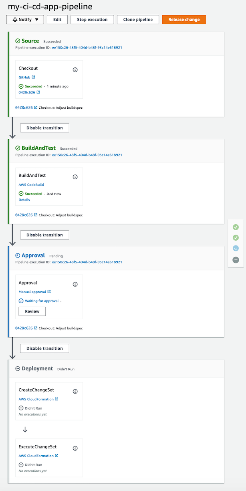
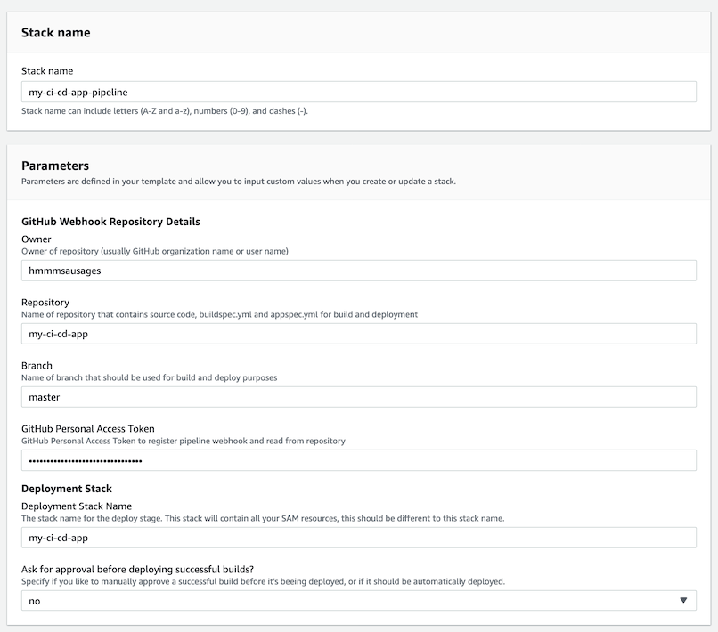

# aws-codepipeline-cicd-clouformation-templates

This repo is a collection of AWS CloudFormation templates, that will set up a CI/CD pipeline with AWS CodePipeline for code public and private repositories hosted on GitHub.

## lambda/cicd-sam-lambda

**Note**: Creating this stack requires your AWS account to have CloudFormation permissions and permissions to create all the mentioned resources below.



### What does it do?

This parameterized CloudFormation template creates a CI/CD CodePipeline for a Lambda application that is using the SAM (Serverless Application Model) framework. It will automatically run on GitHub push events on the specified branch and repo, build and test it with via a CodeBuild project, and then deploy it via CloudFormation by using the SAM template within the repository.

### When should I use it?

You would like to continuously deploy changes to your SAM-based Lambda application, without having to manually run the SAM CLI tool and ensuring that all deployments have run through multiple build steps in CodeBuild before they get released. This for example offers you a good way to enforce that all automated tests have passed before your Lambda application will be released.

### What parameters do I need to provide ?



* Stack Name:
  * CloudFormation stack name will contain this CI/D pipeline setup but won't include the actual deployed SAM app. Usually you could just name this `<your app name>-pipeline`
* GitHub Webhook Repository Details
  * Owner
    * Owner of repository (usually GitHub organization name or user name)
  * Repository
    * Name of repository that contains source code, buildspec.yml and appspec.yml for build and deployment
  * Branch
    * Name of branch that should be used for build and deploy purposes (e.g. `master`)
  * GitHub Personal Access Token
    * GitHub Personal Access Token to register pipeline webhook and read from repository
    * The webhook will be used to trigger the AWS CodePipeline automatically on each `push` event to the configured branch
    * The token needs to have following permissions: `admin:repo_hook, repo` (i.e. access commit status and repositories, and write and read webhooks)
    * You can create a new token by navigating to [Profile -> Settings -> Developer Settings](https://github.com/settings/tokens)
* Deployment Stack
  * Deployment Stack Name
    * The stack name for your app. This stack will contain all your SAM resources. This can usually be the same name as your app.
  * Ask for approval before deploying successful builds?
    * Specify if you like to manually approve a successful build before it's beeing deployed, or if it should be automatically deployed.

### What does this template create exactly?

This template creates the following resources:

* Creates AWS CodePipeline (`AWS::CodePipeline::Pipeline`) that uses:
  * GitHub webhook (`AWS::CodePipeline::Webhook`) to automatically trigger the pipeline on each push to the configured branch
  * CodeBuild project (`AWS::CodeBuild::Project`) that based on a `buildspec.yml` file inside of the repository is able to build the project, run all automated tests and prepares the deployment artifact.
    * CodeBuild IAM role (`AWS::IAM::Role`) that is able to log to CloudWatch for build logs, read and store build artifacts in the S3 artifact bucket and read secrets from the secret manager in case it requires them to prepare the deployment artifact.
  * CloudFormation (`AWS::CloudFormation`) steps that use the generated SAM `packaged.yaml` file from the CodeBuild step, to create a CloudFormation change set and subsequently execute it to deploy all changes.
    * CloudFormation IAM role (`AWS::IAM::Role`) that is used to create and execute the CloudFormation change sets. The IAM policy for this role is quite broad, as it requires permissions to create and change a variety of AWS resources (e.g. AWS Lambda, SQS, DynamoDB ...)
  * S3 artifact bucket (`AWS::S3::Bucket`) that is required by the CodePipeline to read and store artifacts between build and deploy stages.

### CodePipeline Flow

The CodePipeline general CI/CD flow is the following:

1. Developer pushes new commit to specified branch
1. Pipeline checks out sources from repository
1. Runs build and tests via CodeBuild. CodeBuild needs to run `sam build` and `sam package` to prepare Lambda app for deployment (see below)
1. (optionally if enabled) Waits for manual approval to deploy to production
1. Deploys Lamnda app and its dependencies via CloudFormation

### CodeBuild buildspec.yml content

The pipeline requires the repository to have a `buildspec.yml` for the CodeBuild job, which uses the SAM CLI to build and package the Lambda app and provides the resulting YAML file to the deploy stage.

This requires you to have the following steps in your `buildspec.yml`

```yaml
version: 0.2

phases:
  # ...
  # Any build and test steps that you need or would like
  # ...

  post_build:
    commands:
      - sam build
      - sam package --output-template-file packaged.yaml --s3-bucket $S3_ARTIFACT_BUCKET --s3-prefix $S3_ARTIFACT_PREFIX

artifacts:
  type: zip
  files:
    - packaged.yaml
```

You must have the `post_build` commands and the `artifacts` section as they are appear above. The referenced environment variable in the `sam package` command are injected automatically by the pipeline and must not be set by you.
This ensures that your packaged SAM application gets uploaded to the correct S3 artifact bucket of your AWS CodePipeline and the subsequent deployment stage uses the correct SAM template to deploy.
